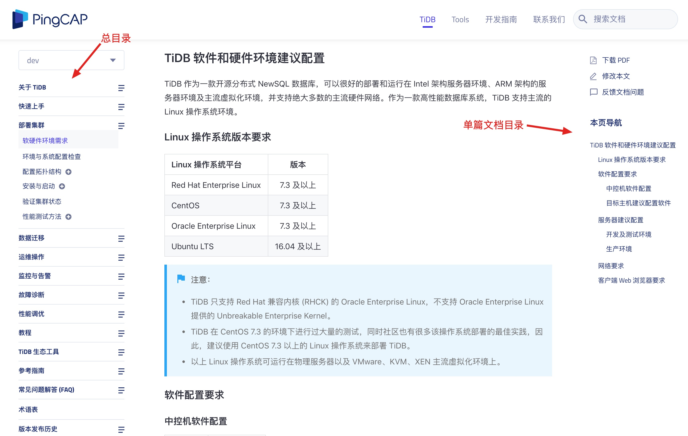

The document table of contents can be automatically generated by headings at all levels, helping users to quickly browse the full text structure and locate chapters.

For a technical manual, a general table of contents (including all chapters and appendices) must be provided. If it is an installation manual, etc., you also need to provide a map directory and a table directory.

The technical manuals published on the web page are generally equipped with navigation bars on both sides, including **full manual navigation bar** and **in-page navigation bar**. These two navigation bars are equivalent to the **general catalogue** and **single document catalogue** of the technical manual.

The following is the directory implementation of the PingCAP technical documentation station:

Notice:

In practice, which [Title Levels](https://zh-style-guide.readthedocs.io/zh_CN/latest/title.html#id2) can be displayed in the navigation bar on the right side of the document is determined by the document framework used. For example, [Docusaurus framework](https://docusaurus.io/docs/en/navigation), although there is no restriction on the title level in the text, only the second-level title (##) and the third-level title can be displayed in the right navigation bar (###), first-level headings (#) and fourth-level headings (####) do not appear in the right navigation bar.

Therefore, it is recommended that companies **customize the title level of the document according to the document framework used**. If the first-level title (#) cannot be displayed in the right navigation bar, you can customize the first-level title in the document to be ##, the second The level heading is ###, and so on.
