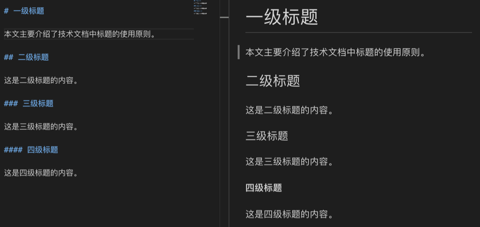
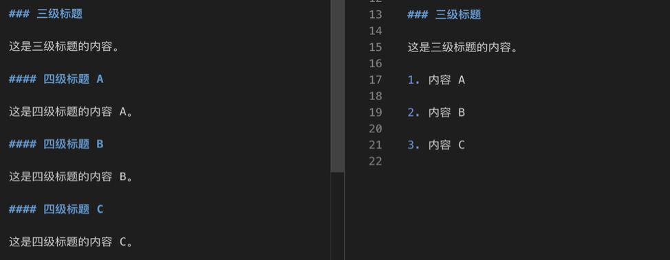

## title

Titles play a very important role in technical documents. Document engineers should design reasonable title levels and title descriptions to help readers clarify the logic of the entire document and make the article structure clear at a glance.

### Title level

No more than four levels of headings can be used in technical documentation. **Titles are used incrementally from the first level, skipping levels are prohibited**. For example, the third-level heading cannot be directly used under the first-level heading; the fourth-level heading cannot be directly used under the second-level heading.

- Level 1 title: the title of the article
- Secondary Title: The title of the body of the article
- Level 3 heading: a subheading one level below the level 2 heading
- Level 4 heading: a subheading one level below the level 3 heading

The following figure is an example of using a title in a Markdown technical document, with the edited text on the left and the preview effect on the right:

In order to avoid overly complicated chapters, it is not recommended to use four-level headings unless there is a special need. If there is parallel content under the third-level heading, it is recommended to use a list (list) instead of the fourth-level heading. As shown in the figure below, if the content A, B, and C are not long, the title style on the right is better than the title style on the left.

### Description of the title

Titles in technical documents include but are not limited to the following descriptions:

- Noun phrases such as "…outline", "…background", "…principle"
- Subject word + verb, such as "A tool installation", "A tool deployment", "A tool configuration"
- verb + subject, such as "configure MySQL database"
- Attributive + subject words, such as "installation of tool A", "architecture of tool A"
- Preposition + attribute + subject word, such as "requirements for machine configuration"

There is no strict template for the design of the title description, as long as the following principles are followed:

- The title can summarize and reflect the central content of the chapter
- The title is concise and to the point, with clear meaning
- Headings of the same level should use the same structure as much as possible
- It is recommended to use the "verb + subject word" structure when the title describes **operational tasks**, and it is not recommended to use noun phrases
### Notes on using headers

The main points for using titles in technical documents are as follows:

- Subordinate titles are prohibited from repeating the content of the previous title
- It is not recommended to end titles with punctuation marks (such as periods or question marks)
- It is not recommended to explain abbreviations in the title
- There should be an introductory sentence between the title and the title. For example, there should be introductory content between the first-level and second-level headings, and body content between the second-level and third-level headings
- The title should avoid isolated numbering (that is, there is only one title at the same level), and the text should not have isolated third-level and fourth-level headings
- The item list is the smallest unit of numbering, so it is forbidden to nest any level of headings under the item list
